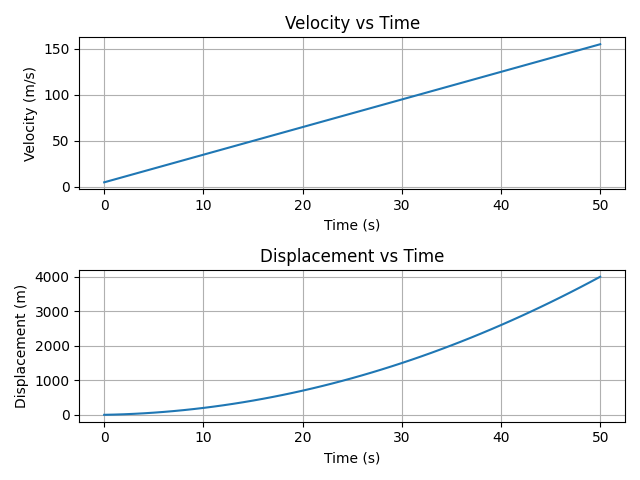
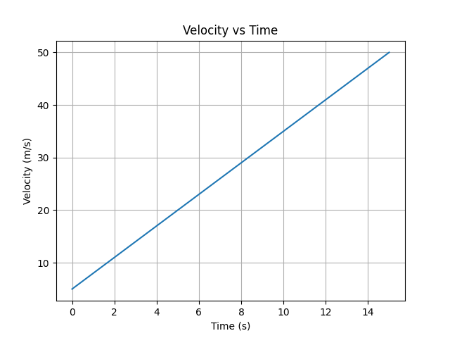
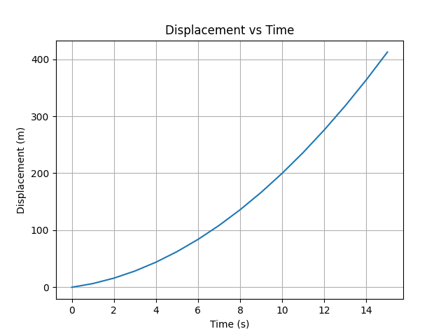
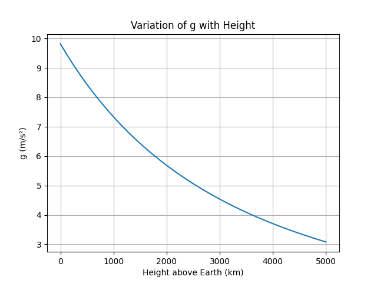
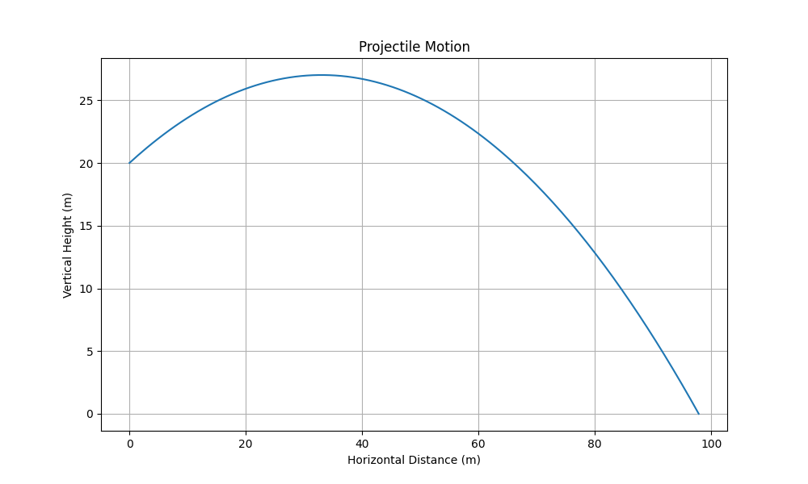
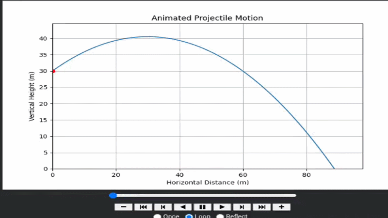

# Physics Simulator 

A Python-based physics simulator designed to visualize and solve core concepts of mechanics such as motion, gravitation, and satellite physics through calculations and graphs.

---

##  Features

- Motion analysis (Velocity-Time & Displacement-Time graphs)
- Gravitation and satellite calculations
- Planet presets (Earth, Moon, Mars, Jupiter, etc.)
- Graphical visualization using matplotlib
- Error handling for invalid inputs
- Multiple physics formulas integrated in one tool

---

##  Preview

### Motion Graph (Velocity-Time & Displacement-Time)

### Velocity Graph

### Displacement Graph

### g vs Height Graph

### Projectile Motion Visualizer

## Animated Projectile Motion

##  Technologies Used

- Python
- NumPy
- Matplotlib
- Google Colab

---

##  How to Run

1. Open the notebook in Google Colab  
2. Run all cells  
3. Choose options from the menu  
4. Input required values  
5. View results and graphs  

---

##  Concepts Covered

- Kinematics (motion equations)
- Gravitation
- Escape velocity
- Orbital velocity
- Satellite motion
- Variation of g with height

---

##  Future Improvements

- Simple Harmonic Motion (SHM)
- Friction and rotational mechanics
- Orbit simulator (animation)
- N-body gravity simulation
- Better UI (possibly GUI or web version)

---

##  Purpose

This project was built to:
- Strengthen understanding of physics concepts  
- Apply programming to real-world problems  
- Create an interactive learning tool  

---

##  License

This project is licensed under the MIT License.
